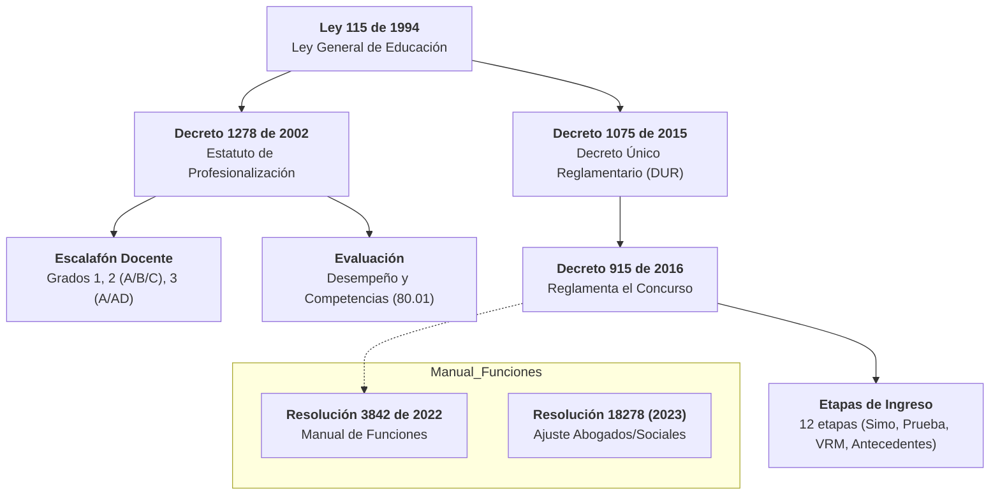
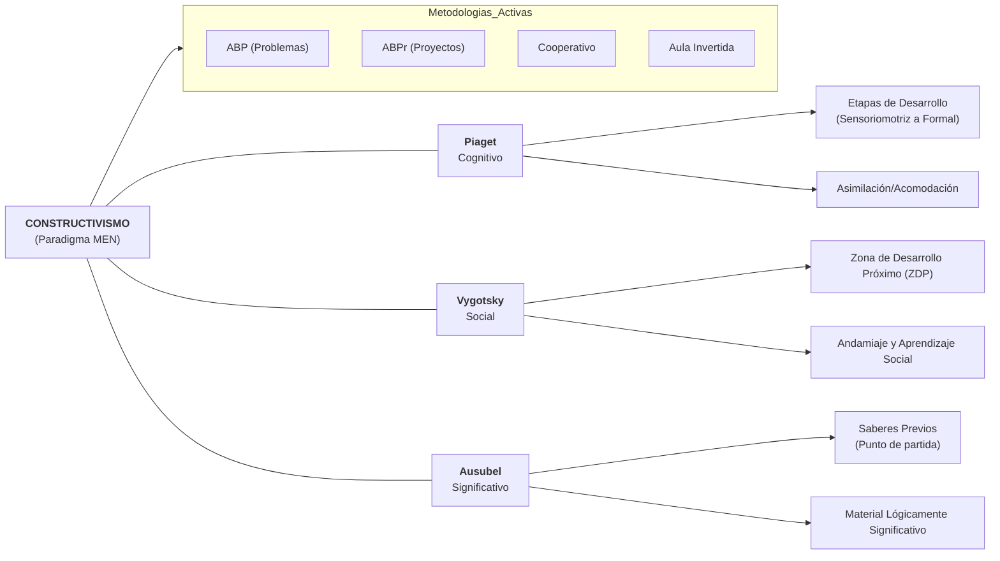
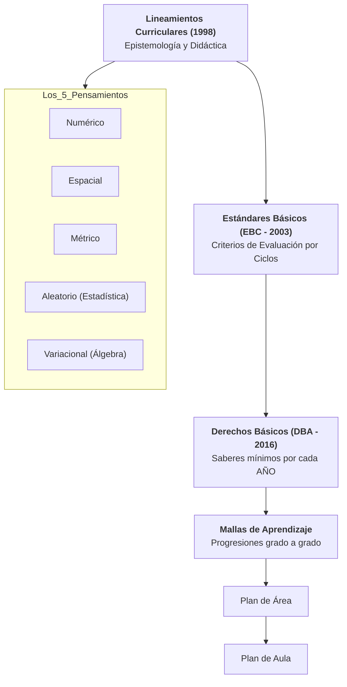
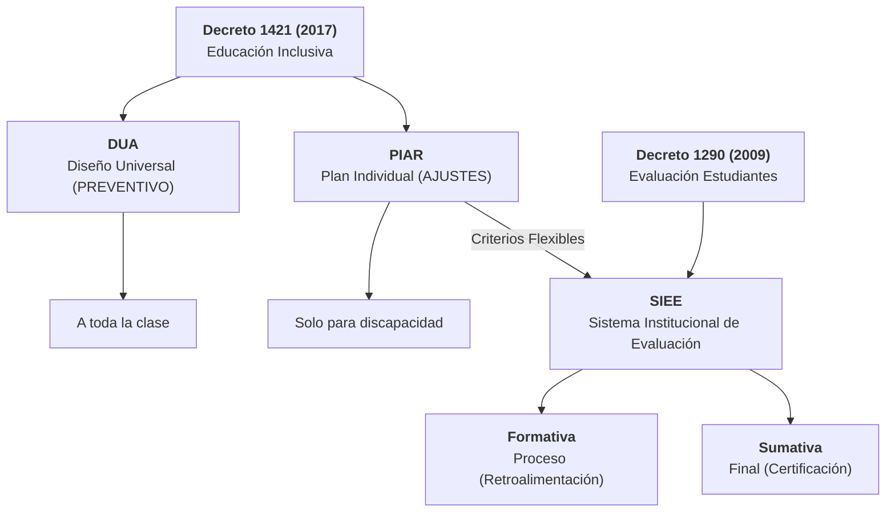
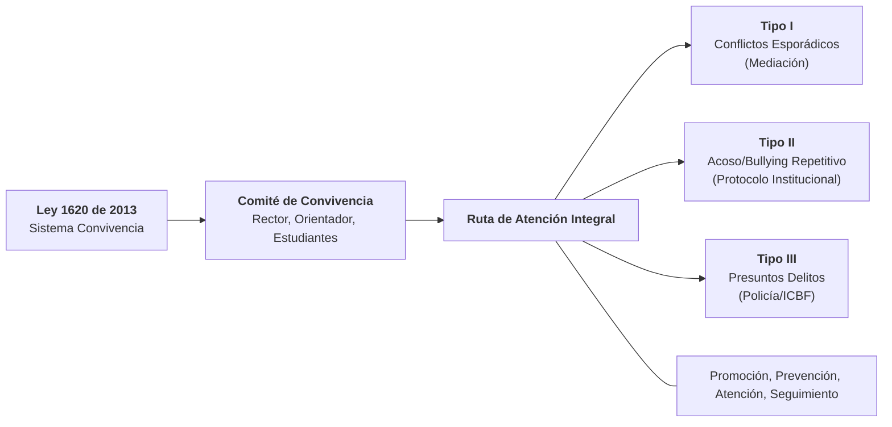

# 🗺️ Mapas de Conexión Temática — Concurso Docente 2026

Estos mapas utilizan la técnica de **Elaboración**: conectan las leyes, decretos y conceptos pedagógicos para que entiendas el *porqué* de cada norma y su aplicación en el aula.

---

## 🏛️ Mapa 1: Marco Normativo de la Carrera
Este mapa conecta la base legal desde la Ley General hasta los decretos específicos que rigen tu futuro cargo.

---

## 🧠 Mapa 2: El Universo Pedagógico (Constructivismo)
Como Ingeniero, verás que la pedagogía del MEN es una estructura lógica centrada en la construcción activa del sujeto.

---

## 📐 Mapa 3: Ecosistema Curricular de Matemáticas
Vital para tu prueba específica. Muestra cómo se "aterriza" la teoría a la clase de matemáticas.

---

## 🌈 Mapa 4: Inclusión y Evaluación Integral
Cómo se conectan el Decreto de Inclusión con el sistema de notas institucional.

---

## 🤝 Mapa 5: Convivencia y Ruta de Atención
Clave para la prueba psicotécnica y de juicio situacional.

> [!IMPORTANT]
> **Relación para el examen:** En el examen de juicio situacional, siempre piensa en qué mapa se ubica el problema. Si es un niño que no aprende, piensa en el **Mapa 4** (DUA/PIAR). Si es una pelea, piensa en el **Mapa 5** (Ruta Tipo II o III). Si es una duda salarial o de cargo, piensa en el **Mapa 1**.
